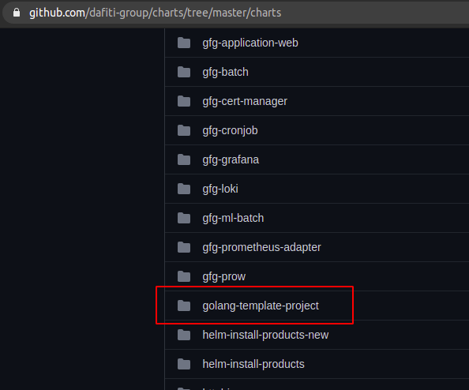
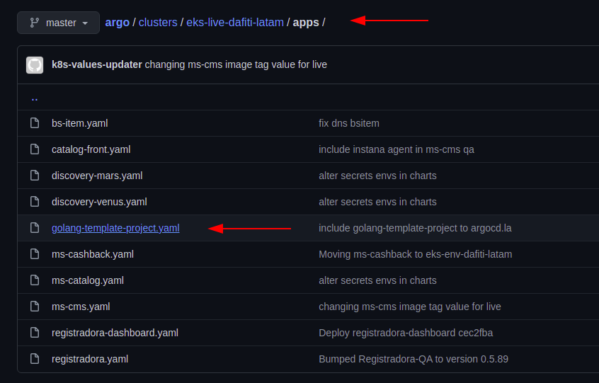
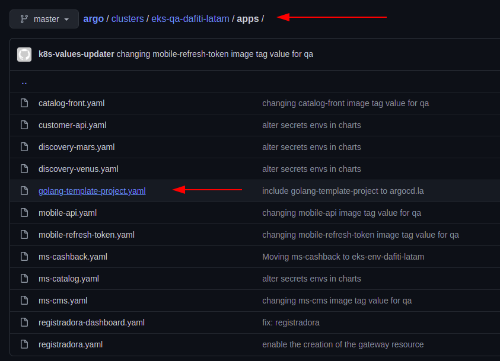

# Including your new application in Chart and Argo

___

## Fisrt step: handle chart repo

First clone [https://github.com/dafiti-group/charts](https://github.com/dafiti-group/charts)
and create a new branch from master like `including-APPLICATION-REPO-NAME` and duplicate the folder
`golang-template-project` and rename with **__APPLICATION-REPO-NAME__**

\
__figure 1: example of folder with APPLICATION-REPO-NAME__

Inside this folder you will find the follow files:

- Charts.yaml
- README.md
- requirements.yaml
- values.yaml

You need to **__find and replace__** `golang-template-project` inside all those files
and change to **__APPLICATION-REPO-NAME__**  in all `*.yaml` files.\
In the `values.yaml` file you will find all shared resources used in the cluster.
This file keeps all values that are common between live and qa environmnets and
all other configurations that are unique for a environment will be explained in
the STEP 2.

By default, if you copy `golang-template-project` folder, all configuration is
already done to run a golang ms, but if you need to increase the resource limits
you need to do this in this place and not in the argo repo!

___

## Second step: handle argo repo

First clone [https://github.com/dafiti-group/argo](https://github.com/dafiti-group/argo)
and duplicate the files (to the same folder):

- `clusters/eks-qa-dafiti-latam/apps/golang-template-project.yaml`
- `clusters/eks-live-dafiti-latam/apps/golang-template-project.yaml`

Rename then with the name of *APPLICATION-REPO-NAME* and inside
the new files, find and replace all `golang-template-project` to
the name of your application repo name and "*__voila__*".

Inside of these files, you will find all exclusive values for
a specific environment you need and the moust important config
you must do is change the `extraEnv` and `secretEnv` values.

By default, all initial config of this template is correct to run
your application, so when your application grows with new env vars,
remember to update this `yamls` file

>The argo repository does not have the need to create a new branch
and pull requests. You can make all changes and push to master.
But if you are not confident that your changes are valid,
you can create a new branch and create a PR to SRE team
validate, but it's optional.
___

\
*__figure 2: argo qa file path and file example__*

\
*__figure 3: argo live file path and file example__*

>The information above is important to define the step [CONFIG-CICD.md](./CONFIG-CICD.md#L35)
## The next step is ops repo and terraforms template [HERE](./CONFIG-OPS.md)

## Back to [HOME](../README.md)

