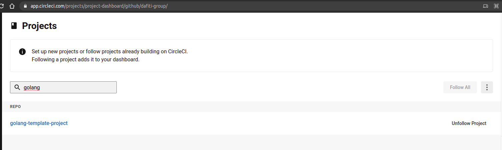
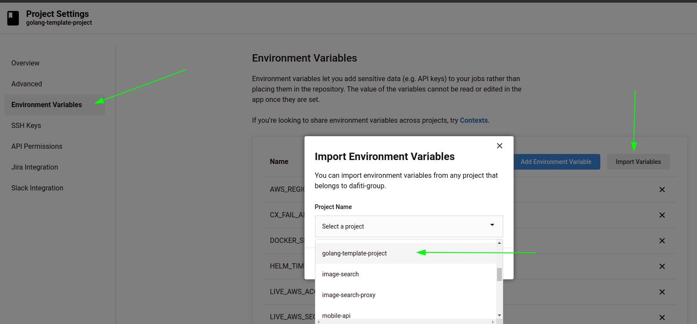

# How to setup

The purpose of this document is to explain the steps you need to follow to achieve the goal
of put your application up and running in `Circle CI`.

**__Before continue, make sure you already have completed these steps:__**

- **__Include my application in ops repo__** [HERE](CONFIG-OPS.md)
- **__Include my application in argo and chart repos__** [HERE](CONFIG-CHART-AND-ARGO.md)

___

## Editing config.yaml

>If you follow strict steps of `CONFIG-CHART-AND-ARGO.md` you don't have to
do anything!!!

The settings is done!.

Link to [circle ci file](../.circleci/config.yml#L142)

All `./.circleci/config.yaml` is agnostic, so the only thing you need to pay
attention is in the path to config file placed in `argo` repo as below:

```yaml
deploy-to-qa: #(check in the `deploy-to-live` as well)
  ...
  command: |
    ...
    cd argo/clusters/eks-qa-dafiti-latam/apps <<<< here<-|
    # in the line above, is an exemple of where          |
    # the file `<your-application-repo-name>.yaml` is    |
    # placed, so if you placed in other path, update---->|
```

And done!!!

>The paths in `argo` repo:
>
>- `clusters/eks-qa-dafiti-latam/apps/` for qa environment
>- `clusters/eks-live-dafiti-latam/apps/` for live environment
>
>Is the place where `https://argocd.dafiti.la` is listening
to deploy applications at this very moment so in the future,
if things change in SRE definitions, we need to move this
configuration files from these folders to the new place!


## In Circle CI dashboard

1. Navigate to:
[https://app.circleci.com/projects/project-dashboard/github/dafiti-group/](https://app.circleci.com/projects/project-dashboard/github/dafiti-group/)
and find your new *APPLICATION-REPO-NAME* in the list as below:
\
**__figure 1: Circle CI dashboard__**

1. Click in the correspondent link and clone the environments of `golang-template-project`

**__figure 2: Importing variables from other project__**\
This step will add all environments to deploy!.


## Next step: configuring your new GO ms [HERE](./CONFIG-MS.md)

## Back to [HOME](../README.md)
