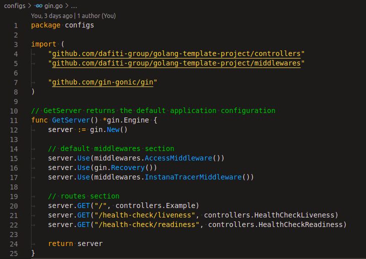
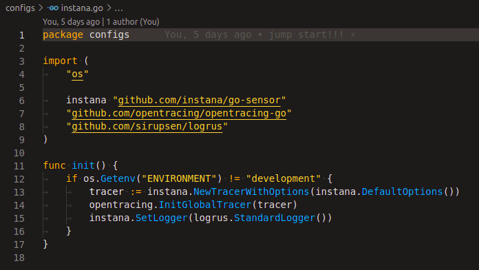
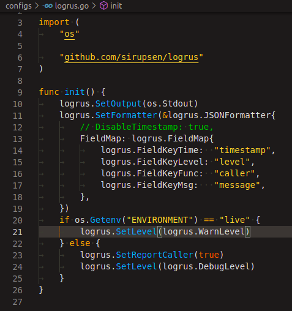
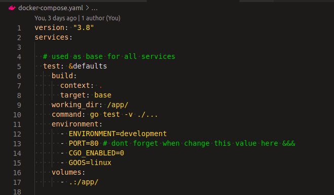

# Project configurations

>All values to configure this application is provided by ENVIRONMENTS
so never put a static configuration in anywhere! You must keep this
code agnostic of environment, and the responsability to config this
variables is the `docker-composer.yaml` and QA end LIVE values is
placed in the step [configure chart and argo repo](./CONFIG-CHART-AND-ARGO.md)

This project is simple, so the main configurations is
placed in `config` folder, and the name of each file represents
the name of each "thing" it is configuring as below:

## Web framework: GIN

Gin is a HTTP web framework used in this template. The file
`gin.go` is responsable to configure default middewares and routes.

## APM: Instana

This template is configured to use Instana APM and the boot config
is placed in `./configs/instana.go`

## Log interface: LOGRUS

The file `logrus.go` is responsible to standardize the default
log structure defining `timestamp, level, caller, message` that
will be present in every row of log of this application!

## Environments variables

All envs is placed in `docker-compose.yaml` so when your aplication grows,
you must place all new envs there as below:

## (Optional) Next step, Using VScode devcontainer [HERE](./CONFIG-VSCODE.md)

## Back to [HOME](../README.md)
