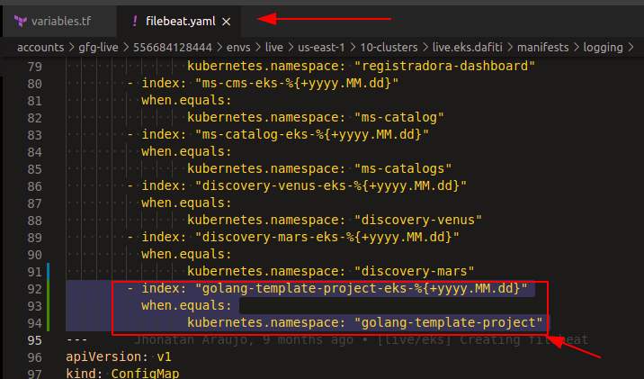

# OPS: creating the resources in AWS docker repository and filebeat rules

First of all, you need to clone the repository
[https://github.com/dafiti-group/ops](https://github.com/dafiti-group/ops)
, and create a new branch from master and follow the steps below.

## Creating a docker repository in AWS for the new repo

In the file `accounts/gfg-live/556684128444/envs/live/us-east-1/03-ecr/variables.tf`
you **__need to include APPLICATION-REPO-NAME in the last position of this array as below__**:

___

## Creating the filebeat rules to send logs to kibana and graylog

### LIVE

In the file `accounts/gfg-live/556684128444/envs/live/us-east-1/10-clusters/live.eks.dafiti/manifests/logging/filebeat.yam`
you need to create a new index to filebeat send log information to kibana as below:

### QA

Is the same process of live but in a different file:
`accounts/dafiti-dev/678591175058/envs/qa/us-east-1/10-clusters/qa.eks.dafiti.local/manifests/10-logging/10-filebeat.yaml`

>You can see the PR to include `golang-template-project` here: [PR link](https://github.com/dafiti-group/ops/pull/2025)

## Next step, config Circle CI [HERE](./CONFIG-CICD.md)

## Back to [HOME](../README.md)
