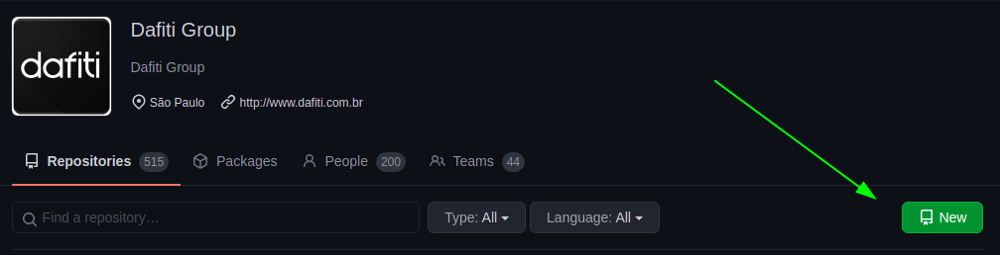
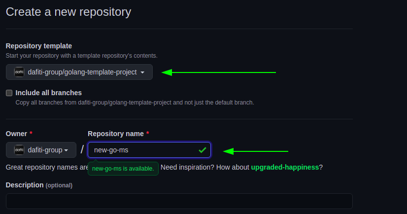

# Using this project as base

To use this project as a template is simple, follow the steps below:

1. Go to [https://github.com/dafiti-group](https://github.com/dafiti-group)
and click in `new` button.

1. In the create new repository scream, select `golang-template-project`,
specify the name of your new repository ( *in the next steps we call this name APPLICATION-REPO-NAME* )

Once you click in `Create repository` you must clone this repo
in your machine.

## Continue configuration [HERE](./CONFIG-CHART-AND-ARGO.md)
>the next step is configuring the resources and environments to deploy

## Back to [HOME](../README.md)
