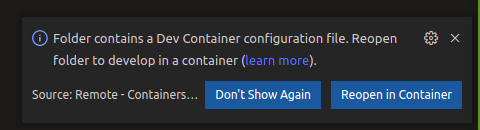
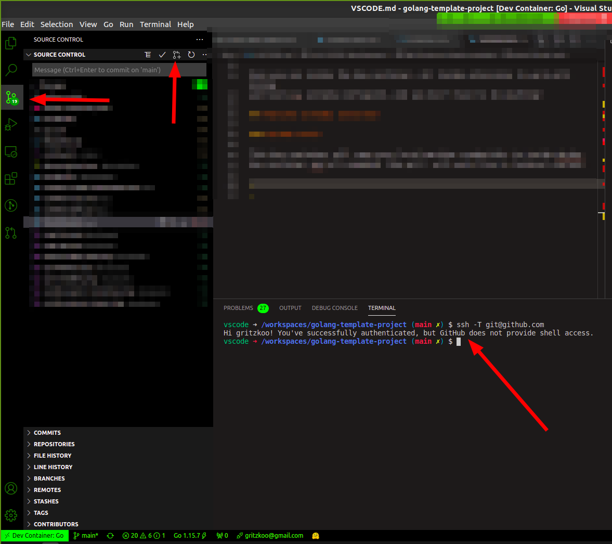

# VS-CODE development

If you are familiar with VScode, this project can run all things in
dev-container. To be able to use these features, you will need to install
the extension below:

- Name: Remote - Containers
Id: ms-vscode-remote.remote-containers
Description: Open any folder or repository inside a Docker container and take advantage of Visual Studio Code's full feature set.
Publisher: Microsoft
VS Marketplace Link:
[https://marketplace.visualstudio.com/items?itemName=ms-vscode-remote.remote-containers](https://marketplace.visualstudio.com/items?itemName=ms-vscode-remote.remote-containers)

And nothing more!! Yes, it is!! just that! :)
But, you need to have previously `Docker` and `docker-compose` installed,
you can follow the steps in the documentation of the Docker site
to accomplish this goal!

[Install Docker](https://docs.docker.com/engine/install/ubuntu/)
[Install Docker-compose](https://docs.docker.com/compose/install/)

Once the plugin, Docker and Docker Compose are already installed,
reload VScode, and the popup should appear.

\
**__figure 1: Popup to aks to reopening in dev-container__**

But, if this popup does not appear, don't worry. You only need to:

\
**__figure 2: step to reopening VScode in dev-container__**

Once you are inside the dev container, all Vscode extensions to work with Golang
and tools are already configured.

## Features already installed

___

### GO tools

The list below is the available tools already installed:

- ast-to-pattern
- dlv
- fillstruct
- go-outline
- go-symbols
- gocode
- godef
- godoctor
- gogetdoc
- goimports
- golint
- gomodifytags
- gopkgs
- goplay
- gopls
- gorename
- goreturns
- gotests
- impl
- irdump
- keyify
- rdeps
- revive
- staticcheck
- structlayout-optimize
- structlayout-pretty

#### GO language suport

>See more in [https://marketplace.visualstudio.com/items?itemName=golang.go](https://marketplace.visualstudio.com/items?itemName=golang.go)

#### Go Autotest

>See more in [https://marketplace.visualstudio.com/items?itemName=windmilleng.vscode-go-autotest](https://marketplace.visualstudio.com/items?itemName=windmilleng.vscode-go-autotest)

### Github tools

This dev container will copy your local machine credentials to Docker
dev container, and all commands like git * will work fine in the terminal context.

\
**__figure 3: vscode inside dev-container__**

The image above shows the integrated terminal performing a git
login and the output show all configuration done with no action!

In the left context of VScode, you can see that all git actions
is available inside, and you don't have to do all commands
to make your daily actions!

#### Github pull requests and issues lib

>See more in [https://marketplace.visualstudio.com/items?itemName=github.vscode-pull-request-github](https://marketplace.visualstudio.com/items?itemName=github.vscode-pull-request-github)

#### Gitlens supercharded

\
\

>See more in [https://marketplace.visualstudio.com/items?itemName=eamodio.gitlens](https://marketplace.visualstudio.com/items?itemName=eamodio.gitlens)

___

### Quick types for JSON

It is an extension to provide quick translations of JSON
into interfaces and structs in all languages. This extension
helps to create structs in Golang target.

>See more in [https://marketplace.visualstudio.com/items?itemName=quicktype.quicktype](https://marketplace.visualstudio.com/items?itemName=quicktype.quicktype)

___

### GRAMMARLY

This extension will help you to write markdown files with better
English syntax and cohesion! Once you write some misspelled words,
a squiggled line appears as an error in your documentation, and
a light bulb shows how to fix your text!

>See more in [https://marketplace.visualstudio.com/items?itemName=znck.grammarly](https://marketplace.visualstudio.com/items?itemName=znck.grammarly)
___

### Docs YAML Extension

>See more in [https://marketplace.visualstudio.com/items?itemName=docsmsft.docs-yaml](https://marketplace.visualstudio.com/items?itemName=docsmsft.docs-yaml)

#### YAML

 

 >See more in [https://marketplace.visualstudio.com/items?itemName=redhat.vscode-yaml](https://marketplace.visualstudio.com/items?itemName=redhat.vscode-yaml)

___

### Markdownlint

TL,DR
>See more in [https://marketplace.visualstudio.com/items?itemName=davidanson.vscode-markdownlint](https://marketplace.visualstudio.com/items?itemName=davidanson.vscode-markdownlint)

___

### Swagger Snippets

>See more in [https://marketplace.visualstudio.com/items?itemName=adisreyaj.swagger-snippets](https://marketplace.visualstudio.com/items?itemName=adisreyaj.swagger-snippets)
